# Trabalho 3

Aluno: Tony Alexander Hild

([Descrição do trabalho](#Descrição-do-trabalho))

(https://github.com/thild/doc/tree/master/ml/work3)

# Relatório

## Redes com camadas e número de neurônios variados e 20 épocas

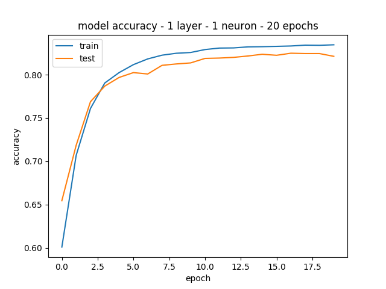
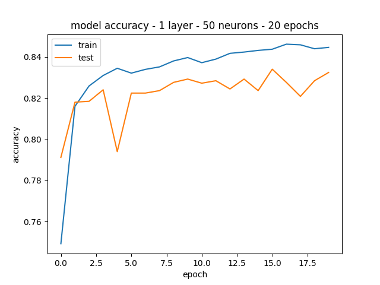

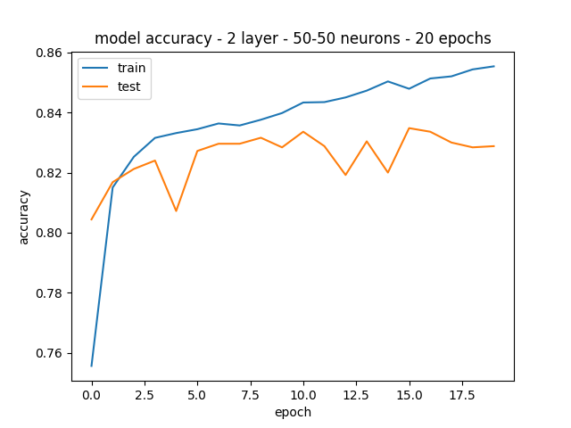
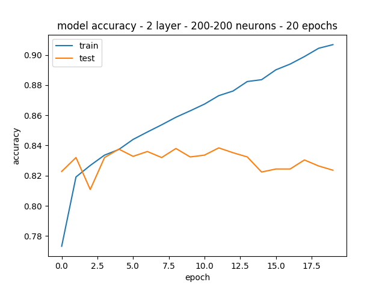

A rede com melhores resultados foi com a configuração de 1 camada e 200 neurônios, com 83,35% de acurácia. No entanto, a rede com apenas 1 neurônio teve acurácia parecida com também 20 épocas.

As redes com mais de uma camada e com mais neurônios por camada tenderam a overfit.

## Redes com 1 camada, 50 neurônios e várias épocas
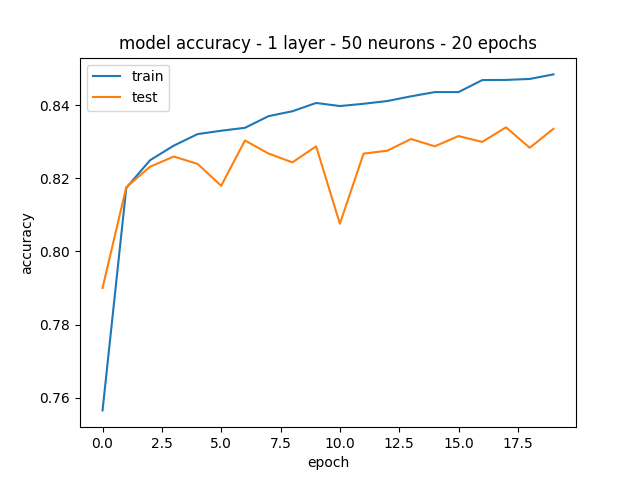
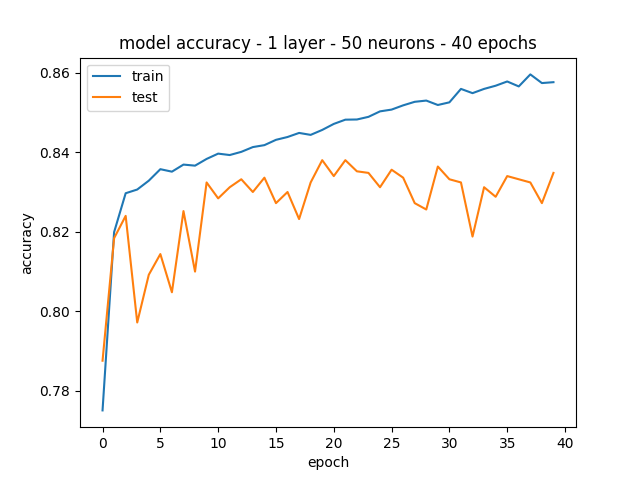
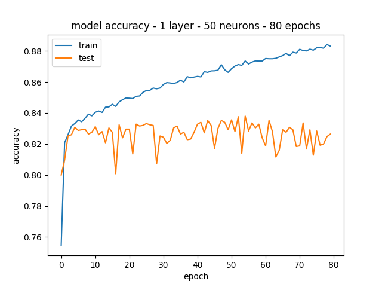
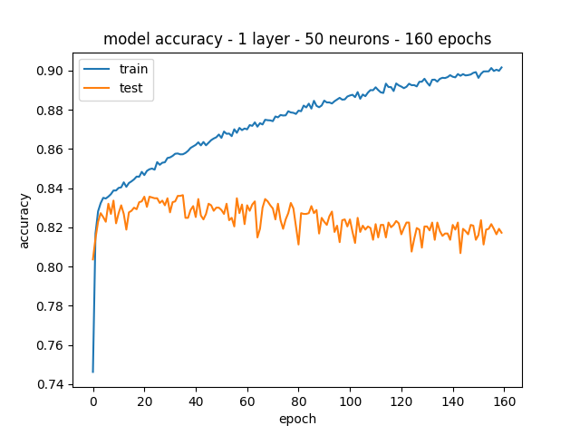
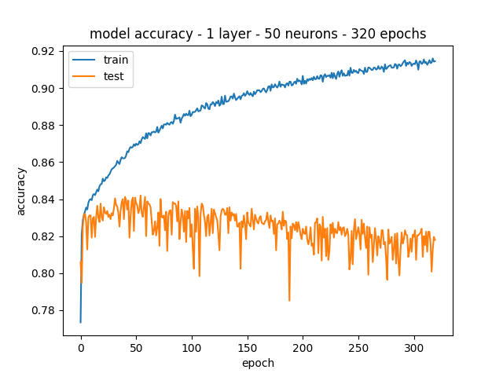

Com relação à quantidade de épocas de treinamento, fica evidente o a piora na acurácia a partir de 80 épocas, tendendo a overfit.

## Comparação com versões com classificadores implementados anteriormente

Comparando com os trabalhos anteriores para KNN e SVM, a MLP teve resultados intermediários, porém há diferenças nas bases.

Para o KNN as características foram extraídas usando o algoritmos doc2vec da biblioteca gensim com os seguintes parâmetros:

```  Doc2Vec(min_count=1, window=10, size=100, sample=1e-4, negative=5, workers=16) ```

O modelo foi treinado durante 20 épocas.

O melhor K encontrado nos testes empíricos foi 9.

O melhor score obtido foi 76% com 5000 instâncias de treinamento e 5000 instâncias de teste.

Para o SVM usou-se os parâmetros c=2.0 e g=0.03125, obtendo-se acurácia de 96.6667%.

A melhor rede encontrada, com 1 camada e 200 neurônios, e com 20 épocas de treinamento obteve uma acurácia de 83,35%

## Dígitos (Exercício 2)

O teste com CNN com a base dígitos não apresentou muitas diferenças com relação à mudança de parâmetros. O número de épocas teve maior impacto. Com duas épocas obteve-se 87% de acurácia e com 20 épocas 97%. Com variações em tamanho de kernel, polling e dropout obteve-se resultados também ao redor de 97%. As alterações em número de camadas diminuíram a acurácia para ~95%, bom como alterações nas funções de ativação.

Default 2 épocas: 81%

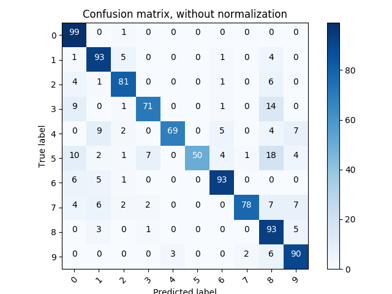


20 épocas: 97%

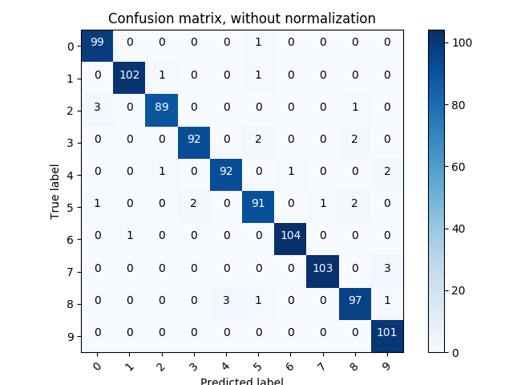


20 épocas, kernel 5x5: 97%


20 épocas, kernel 3x3, AveragePooling2D 3x3: 96,1%


20 épocas, kernel 3x3, AveragePooling2D 2x2: 96,6%
![]
(./cnn/cm_digits/cnn_epoch_20_kernel_3x3_AveragePooling2D_2x2.png)


20 épocas, kernel 3x3, MaxPooling2D 3x3, Dropout 0,10/0,70: 96,8%


20 épocas, kernel 3x3, MaxPooling2D 2x2, Dropout 0,10/0,70: 96,8%


## Meses (Exercício 2)

Para esta rede foram realizado apenas dois experimentos. No experimento *default* com a base sem *data augmentation* e 10 épocas de treinamento obteve-se acurácia de 75%.


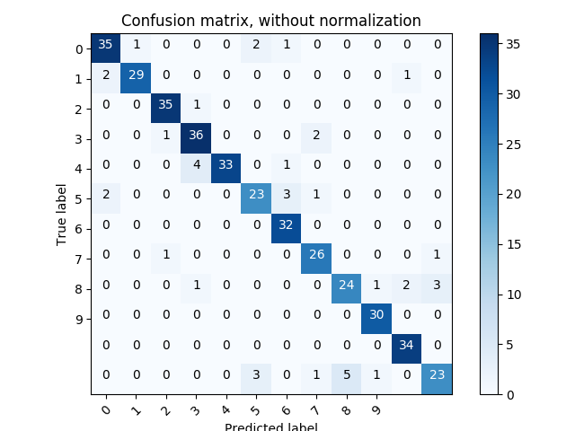


O outro experimento foi realizado com *data augmentation* e 20 épocas de treinamento, sem alterações nos parâmetros da rede. Para *data augmentation* foi utilizada a biblioteca `Augmentor` com `random_distortion` que gerou um total de 19031 samples. A acurácia para este experimento foi de 89,7%.


```python
#!/usr/bin/python 

import Augmentor

p = Augmentor.Pipeline("./data/")
p.random_distortion(probability=1, grid_width=5, grid_height=5, magnitude=5)
p.sample(20000)
p.process()
```

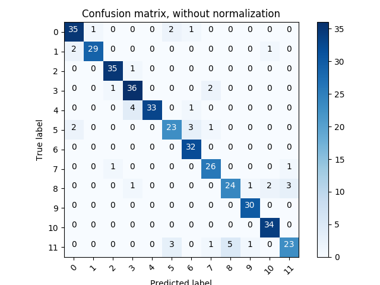


# Descrição do trabalho

Exercícios Redes Neurais

Exercício 1:

Avalie a rede neural MLP para a classificação da base IMDB (mlp.zip). A rede em anexo contem uma camada escondida com 50 neurônios. A saída com duas possibilidades contém uma função de ativação softmax. Escreva um relatório avaliando:

    A quantidade de neurônios na camada escondida
    Quantidade de camadas escondidas 
    Número de épocas de treinamento
    Overfitting da rede. Faça um gráfico mostrando a acurácia no treinamento e validação. Verifique se a rede entra em overfitting depois de um certo número de épocas de aprendizagem. 
    Compare a melhor rede encontrada com outros classificadores vistos em sala de aula. 

Exercício 2:

Avalie as CNN para os dois problemas em anexo (dígitos e meses do ano - CNN.zip). Escreva um relatório avaliando os mesmos item do exercício anterior e também os parâmetros das camadas de convolução (tamanho do filtro, função de ativação, tipo de pooling, quantidade de camadas de convolução). Reporte os melhores resultados para as duas aplicações juntamente com as matrizes de confusão. 


Copyright (c) 2018 Tony Alexander Hild

Permission is hereby granted, free of charge, to any person obtaining a copy of this software and associated documentation files (the "Software"), to deal in the Software without restriction, including without limitation the rights to use, copy, modify, merge, publish, distribute, sublicense, and/or sell copies of the Software, and to permit persons to whom the Software is furnished to do so, subject to the following conditions:

The above copyright notice and this permission notice shall be included in all copies or substantial portions of the Software.

THE SOFTWARE IS PROVIDED "AS IS", WITHOUT WARRANTY OF ANY KIND, EXPRESS OR IMPLIED, INCLUDING BUT NOT LIMITED TO THE WARRANTIES OF MERCHANTABILITY, FITNESS FOR A PARTICULAR PURPOSE AND NONINFRINGEMENT. IN NO EVENT SHALL THE AUTHORS OR COPYRIGHT HOLDERS BE LIABLE FOR ANY CLAIM, DAMAGES OR OTHER LIABILITY, WHETHER IN AN ACTION OF CONTRACT, TORT OR OTHERWISE, ARISING FROM, OUT OF OR IN CONNECTION WITH THE SOFTWARE OR THE USE OR OTHER DEALINGS IN THE SOFTWARE.